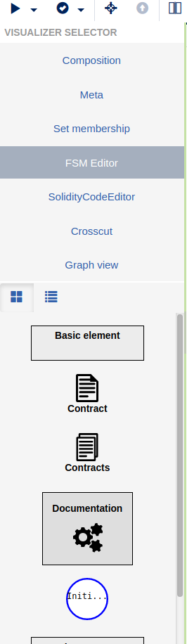
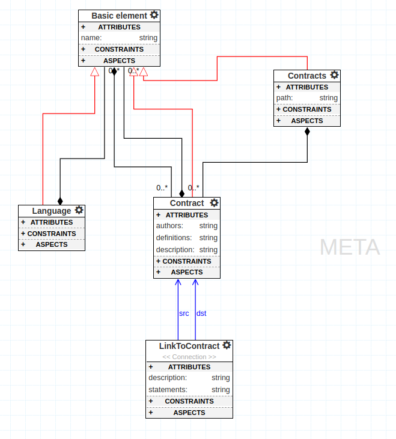

# SmartContracts

## Installation

Please use Linux or MacOS as operating system for FSolidM. The tool does not run properly in Windows or in a Docker Container because the MongoDB has a problem with the Windows Linux Kernel. Please do not try it, it is a waste of time! 

If you are Windows user doing the following steps: 

Install a Virtual Box and an Ubuntu Linux: 
- [VirtualBox](https://www.virtualbox.org/)
- [Ubuntu](https://ubuntu.com/download)

else you can directly install FSolidM, you need:
- [NodeJS](https://nodejs.org/en/download/) (v4.x.x recommended)
- [MongoDB](https://www.mongodb.com/download-center#production)

To clone the repository, first install (if necessary):
- [Git](https://git-scm.com/downloads)

and then clone the repository in your preferred directory, for example:
```
cd /home/$USER
https://github.com/c3ai-lab/smart-contracts
```
This makes the 'project root' for the git repo `/home/$USER/smart-contracts`.

Install packages with npm in the project root (`smart-contracts`):
```
cd /home/$USER/smart-contracts
npm install
npm install webgme
npm install -g bower
bower install
```
Start mongodb locally by running the `mongod` executable in your mongodb installation (you may need to create a `data` directory or set `--dbpath`). For example:
```
cd /home/$USER
mkdir sc_data
mongod --dbpath ./sc_data
```
wait until you see a line that says "[initandlisten] waiting for connections on port 27017".

Then, in a new terminal window, run `npm start` from the project root (`smart-contracts`) to start. For example:
```
cd /home/$USER/smart-contracts
npm start
```

After the webgme server is up and there are no error messages in the console, open a valid address in the browser to start using the Smart Contracts. The default is http://127.0.0.1:8888/, you should see all valid addresses in the console.


# Getting Started

The tool has different hierachical levels for navigation and customization of the project. When you starting the tool you have to create a new project and choosing a project name. Afterwards you have to choose an existing seed. In the seed is an existing meta model which provides you basic configurations.

## Create a Project
Click `Create New…` to create a new project.
After entering a project name of your choice, import the seed `Linked_SC` to start working on smart contracts!


On the left side you can find the visualizer selector. Here you can switch between the relevant views like Compostition View, Meta View, FSM Editor and Solidity Code Editor.



On the right side is the object browser. Here can you see and manage the structure of your project items. Rename, delete or create a child is also possible. You can modify the attributes, see the pointers and modify the preferences of an item.  


## Compostition View
In the Composition View is it possible to place a contract per drag and drop or you can also place a contract item which is a cluster of contracts. 


## Meta View
The Meta View povides the basic data types and relations between the created elements. Via the meta model is it possible to add or delete data types and to define the attributes and properties of the elements. If you want to add, modify a data type you have to do it in the meta model. 



## FSM Editor
The FSM Editor will be used to design a fenite state machine inside a contract. Here can you add predefined states like the "Initial State" and "State". Tranisitions between the states will be drawn by clicking on the states decorators and connect them. You can also link a state and a subcontract.  


## The Solidity Code Editor
The Solidity Code Generator generates automatically the solidity code of the depicted fenite state machine. The generated code is a skeleton of the state machine and can be completed with own functions or variables.


## Solidity Code Generator
On the top left corner of the application can you find a play button. You can open the drop down menu and execute the AddSecurityPatterns or the SolidityCodeGenerator. The security pattern will check the state machine for known vulnerabilites and the solidity code generator will create the .sol files which you need if you want to deploy you contract.


To deploy a created contract you can use [Remix](https://remix.ethereum.org/) for testing.

## WebGME

The FSolidM Tool was setup on Webgme. Understand [WebGME](https://github.com/webgme/webgme-cli) and you are able to use or modify FSolidM. The [WebGME Youtube Tutorials](https://www.youtube.com/channel/UC1cPQP4jjsXRhpXUnoPZQWg) can also be helpful.

